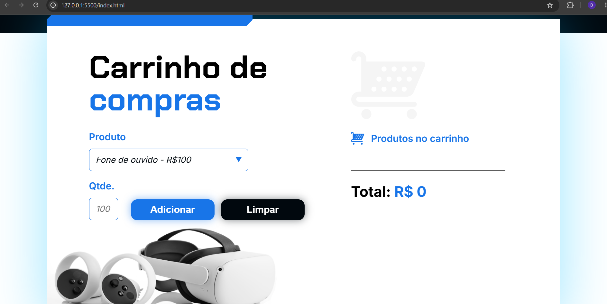

# 🛒 Carrinho de Compras

## 📖 Sobre o projeto

O **Carrinho de Compras** foi desenvolvido durante o curso **Lógica de Programação com JavaScript**, da Alura.

A aplicação simula o funcionamento de um carrinho de compras, permitindo ao usuário selecionar produtos, informar a quantidade desejada e visualizar a atualização automática do valor total da compra.

Durante o desenvolvimento foram aplicados conceitos fundamentais de JavaScript, como manipulação do DOM, operações matemáticas, manipulação de strings e atualização dinâmica da interface.

---

## 🚀 Funcionalidades

- ✅ Selecionar um produto;
- ✅ Informar a quantidade desejada;
- ✅ Adicionar produtos ao carrinho;
- ✅ Calcular automaticamente o subtotal;
- ✅ Atualizar o valor total da compra;
- ✅ Limpar o carrinho e reiniciar a compra.

---

## 🛠️ Tecnologias utilizadas

- HTML5
- CSS3
- JavaScript

---

## 💡 Conceitos praticados

Durante o desenvolvimento deste projeto foram utilizados conceitos como:

- Manipulação do DOM;
- Funções;
- Variáveis;
- Operações matemáticas;
- Manipulação de strings com `split()`;
- Template Literals;
- Atualização dinâmica da interface.

---

## 📂 Estrutura do projeto

```text
📦 carrinho-de-compras
 ┣ 📂 assets
 ┣ 📜 index.html
 ┣ 📜 style.css
 ┣ 📜 app.js
 ┗ 📜 README.md
```

---

## ▶️ Como executar

1. Clone este repositório:

```bash
git clone <SEU-LINK-DO-REPOSITÓRIO>
```

2. Abra o arquivo `index.html` em seu navegador.

---

## 📚 Aprendizados

Este projeto contribuiu para o desenvolvimento das seguintes habilidades:

- Manipulação dinâmica de elementos HTML;
- Cálculo de valores utilizando JavaScript;
- Atualização automática da interface;
- Organização da lógica em funções reutilizáveis;
- Manipulação de strings para extração de informações.

---

## 📷 Demonstração



---

## 👩‍💻 Desenvolvido por

**Bruna Soares de Almeida**

🔗 GitHub: https://github.com/brunasalmeida-dev

🔗 LinkedIn: https://www.linkedin.com/in/bruna-soares-de-almeida-7b4bb8412
